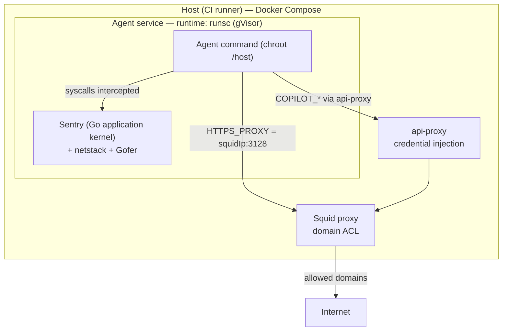

This document explains **gVisor** and how AWF uses it — via the `runsc` OCI
runtime and `--container-runtime gvisor` — to add host-kernel isolation to the
agent container. It is written for two audiences:

1. Engineers who want to understand *how the existing gVisor integration works*.
2. Ourselves, when evaluating or adding other agent-isolation runtimes (Kata,
   another OCI runtime, or gVisor's own KVM platform on bare-metal runners).

:::note
gVisor is the **compose-model** counterpart to the microVM backend documented in
the pending
[Docker Sandboxes (sbx) integration guide (PR #6331)](https://github.com/github/gh-aw-firewall/pull/6331).
With gVisor the agent stays an ordinary Docker Compose service (just with a
hardened runtime); with sbx the agent leaves compose entirely and runs in a
microVM. See also
[Sandbox design](./sandbox-design.md) for why the *default* backend is plain
Docker + Squid.
:::

## Part 1 — What is gVisor?

[gVisor](https://gvisor.dev/) is an open-source **application kernel** that runs
untrusted workloads. It is neither a VM hypervisor nor a syscall filter — it is a
userspace kernel that sits between the sandboxed application and the host Linux
kernel. It ships as an [OCI-compliant](https://opencontainers.org/) container
runtime called **`runsc`**, so it drops into Docker as an alternative runtime.

### How it isolates

- **Sentry (the application kernel)** — a from-scratch reimplementation of the
  Linux syscall interface, memory management, filesystems, process/signal
  handling, and a network stack, written in **memory-safe Go** and running in
  userspace. gVisor **intercepts every syscall** from the workload and services
  it inside the Sentry; it **never passes a syscall straight through** to the
  host kernel. If a kernel feature isn't reimplemented, the workload can't use
  it.
- **Gofer** — a slightly-more-privileged sidecar that brokers host filesystem
  access the Sentry itself is forbidden to make.
- **netstack** — gVisor's userspace TCP/IP stack. The Sentry gets an `AF_PACKET`
  socket on a veth device and runs its own stack on top; the workload sees normal
  networking while the host boundary stays intact. (netstack is why AWF needs a
  DNS workaround — see Part 2.) A `--network=host` (`hostinet`) mode exists that
  trades isolation for native performance, but AWF uses the default netstack.
- **Defense-in-depth** — the Sentry itself is confined with `seccomp-bpf`,
  namespaces, and minimal capabilities, so escaping requires breaking *both*
  gVisor and the host kernel, which share no code.

### Platforms (syscall/page-fault interception)

gVisor can intercept syscalls in more than one way — the "platform":

- **Systrap** (default since mid-2023) — uses `seccomp-bpf`'s `SECCOMP_RET_TRAP`
  to trap syscalls via `SIGSYS`. **Requires no virtualization**, so it runs well
  *inside* a VM — including GitHub-hosted Actions runners, which don't expose
  `/dev/kvm`.
- **KVM** — the Sentry acts as guest kernel + VMM using the host's KVM subsystem;
  workload code runs in guest ring 3. Best on **bare metal**; works under nested
  virtualization but is usually slower than Systrap there.
- **ptrace** — legacy, high context-switch overhead, effectively superseded by
  Systrap.

This is the natural bridge to any "KVM microVM" evaluation: gVisor's KVM
*platform* uses KVM for address-space isolation without booting a full guest
kernel/VMM per sandbox, which is a different trade-off from a true microVM (sbx,
Firecracker) that boots a separate Linux kernel.

### What gVisor does *not* protect against

- Exploits *within* the workload itself (it contains blast radius, but the agent
  still has whatever the sandbox is granted).
- Side-channel / Spectre-class CPU attacks.
- Compromise of higher layers (e.g. the container runtime that launches the
  sandbox).

### Comparison

| Approach | Isolation boundary | Kernel | Overhead |
| --- | --- | --- | --- |
| Plain container (runc) | namespaces + cgroups | shared host kernel | lowest |
| gVisor (runsc) | userspace application kernel | separate Go kernel (Sentry) | low–moderate |
| microVM (sbx, Firecracker) | hypervisor | separate real Linux kernel | highest |

## Part 2 — How AWF uses gVisor

Unlike the sbx microVM backend, gVisor keeps the agent as a **normal Docker
Compose service** — AWF simply sets the service's `runtime:` to `runsc`. The
whole existing AWF model (Squid egress ACL, iptables DNAT, api-proxy credential
injection, chroot, capability drop) stays in place; gVisor adds a hardened kernel
boundary *underneath* it as defense-in-depth.

### The `executionModel` abstraction (`src/container-runtime.ts`)

gVisor is registered with `executionModel: 'compose'`:

```ts
const RUNTIME_REGISTRY = {
  gvisor: { executionModel: 'compose', dockerRuntime: 'runsc', needsStaticDns: true },
  sbx:    { executionModel: 'microvm', dockerRuntime: undefined, needsStaticDns: false },
};
```

Two capability queries drive gVisor's behavior:

- `resolveDockerRuntime('gvisor')` → `'runsc'`, which is written to the compose
  service's `runtime:` field.
- `runtimeNeedsStaticDns('gvisor')` → `true`, which triggers the DNS workaround.

Because the execution model is `compose`, `runtimeUsesComposeAgent('gvisor')` is
`true` — the agent is emitted into `docker-compose.yml` and its lifecycle is
driven by `docker logs`/`docker wait` exactly like the default runtime.

### Applying the runtime (`src/services/agent-service.ts`)

```ts
if (config.containerRuntime) {
  const dockerRuntime = resolveDockerRuntime(config.containerRuntime); // 'runsc'
  if (dockerRuntime) agentService.runtime = dockerRuntime;
  // ...
  if (runtimeNeedsStaticDns(config.containerRuntime)) {
    agentService.extra_hosts ??= {};
    agentService.extra_hosts['squid-proxy'] = networkConfig.squidIp;
    if (networkConfig.proxyIp) agentService.extra_hosts['api-proxy'] = networkConfig.proxyIp;
  }
}
```

### Volume mounting & filesystem access (the Gofer)

gVisor uses AWF's **standard compose agent** — the same service definition as the
default Docker runtime, only with `runtime: runsc`. So the *mount set is
identical to default Docker mode*: AWF applies selective bind mounts under
`/host` (see `src/services/agent-volumes/system-mounts.ts`) and the agent
`chroot`s into `/host` before running:

- `/usr`, `/bin`, `/sbin`, `/lib`, `/lib64`, `/opt`, `/sys`, `/dev` → `/host/*`
  read-only (system libraries and toolchains come from the host, unlike sbx).
- `<workspaceDir>` → `/host<workspaceDir>` read-write; `/tmp` → `/host/tmp`
  read-write.
- When `chroot.binariesSourcePath` is configured, that tool directory is additionally
  mounted at **`/host/tmp/awf-runner-bin`** (ro), and `entrypoint.sh` prepends it
  to `PATH`. This is especially useful for DinD/ARC staged filesystems where the
  runner-installed binaries are not present in the mounted `/usr` tree.
- An empty home volume exposes only whitelisted `$HOME` subdirs; select `/etc`
  files (SSL certs, `passwd`, `group`, `hosts`, …) are mounted individually.

The gVisor-specific twist is **how those mounts are accessed**. A `runsc`
sandbox uses a separate host-side **Gofer** process to mediate path-based
filesystem operations over LISAFS. With directfs (enabled by default in current
`runsc`), the Gofer can pass an opened host file descriptor to the Sentry, which
then performs data I/O directly and avoids repeated Gofer round trips. (9P was
the legacy Sentry-Gofer protocol.) Practical consequences:

- **Isolation:** the sandbox is restricted to the filesystem tree assembled for
  it; the Gofer controls path resolution and opening, while directfs constrains
  subsequent access to the descriptors it passes to the Sentry.
- **Compatibility:** filesystem behavior still follows gVisor's implementation;
  operations such as some `mmap` sharing and exotic `ioctl`s can differ from a
  native bind mount. This is the filesystem analogue of the syscall shims noted
  below and should be validated when a tool works in Docker but not under gVisor.

:::note
Because gVisor reuses the compose agent, there is **no sbx-style host-path ==
guest-path** behavior here: the agent sees files under `/host` (pre-chroot) and
at their normal paths (post-chroot), exactly as in default Docker mode. A new
compose-model runtime inherits this mount set for free; a new *microVM* runtime
(like sbx) must define its own sharing scheme instead.
:::

### The netstack DNS problem (and the fix)

gVisor's userspace netstack has an isolated sandbox loopback that **cannot reach
Docker's embedded DNS resolver at `127.0.0.11`**
([google/gvisor#7469](https://github.com/google/gvisor/issues/7469)). So any
lookup of a compose service name by DNS fails inside a `runsc` agent.

AWF sidesteps this in two complementary ways:

1. **Proxy env vars use IPs, not names.** `HTTP_PROXY`/`HTTPS_PROXY` are set to
   `http://<squidIp>:3128` (see `core-environment.ts`), so the primary egress
   path never needs DNS. `NO_PROXY` also lists the Squid and agent IPs.
2. **Static `/etc/hosts` entries for name-based resolution.** For anything that
   *does* resolve by hostname (`SQUID_PROXY_HOST=squid-proxy`, `api-proxy`, and
   any topology peers), AWF injects static host entries so Docker's embedded DNS
   is never consulted:
   - `agent-service.ts` injects `squid-proxy` and `api-proxy` via compose
     `extra_hosts`.
   - `topology.ts` (`getTopologyContainerIps` + `patchComposeWithTopologyHosts`)
     injects topology-peer IPs after those containers are connected.

:::caution Two hosts files
The agent runs **chrooted to `/host`**, so it reads `/host/etc/hosts`, not the
container's `/etc/hosts`. Docker's `extra_hosts` only populates the *container's*
`/etc/hosts` (outside the chroot). `topology.ts` therefore also **appends peer
entries to the bind-mounted `/host/etc/hosts` file** (falling back gracefully in
sysroot-stage mode where no such mount exists). **Today, that chroot-hosts patch
only runs in the topology-attach startup path in `cli-workflow.ts`**; ordinary
compose runs rely on the IP-based proxy env vars and do not automatically mirror
every static hostname into `/host/etc/hosts`. A new netstack-based runtime must
account for both files.
:::

### iptables DNAT must work inside the sandbox

AWF's defense-in-depth relies on iptables DNAT (port 80/443 → Squid:3128) applied
inside the agent's network namespace. gVisor must support those rules for that
fallback to hold. `.github/workflows/test-gvisor-compat.yml` is a **manual,
non-gating diagnostic probe** that exercises iptables DNAT and proxy reachability
inside a `runsc` sandbox; it is useful evidence, but not an enforced guarantee in
CI.

### Runtime-specific compatibility shims

- **Claude/Bun workaround under gVisor** (`tool-specific-environment.ts`) —
  when the agent is Claude *and* the runtime is gVisor, AWF sets
  `BUN_JSC_useJIT=0` to force Bun's interpreter. This is an AWF workaround for
  crashes observed under that combination, rather than a behavior guaranteed by a
  public upstream repro.

### Configuration surface

- CLI: `--container-runtime gvisor` (unknown values pass through as raw Docker
  runtime names).
- gh-aw workflow frontmatter: `sandbox.agent.runtime: gvisor` (see the
  `smoke-gvisor*` workflows under `.github/workflows/`).
- **Prerequisite:** `runsc` must be installed and registered as a Docker runtime
  in `/etc/docker/daemon.json`. CI installs the `runsc` +
  `containerd-shim-runsc-v1` binaries from the gVisor release bucket and
  registers both `runsc` (netstack) and `runsc-net-host` (`--network=host`)
  runtimes; AWF maps `gvisor` to plain `runsc`.

### Where gVisor sits in the stack



## Part 3 — Adding or relating other compose-model runtimes

gVisor demonstrates the `executionModel: 'compose'` extension seam. Adding
another OCI runtime (e.g. Kata Containers, or a differently-configured gVisor
profile) is mostly registration:

### 1. Register the runtime

```ts
myruntime: {
  executionModel: 'compose',
  dockerRuntime: 'my-oci-runtime',   // the name registered in daemon.json
  needsStaticDns: false,             // true if its netstack can't reach 127.0.0.11
},
```

That single entry makes `resolveDockerRuntime` set the compose `runtime:` field.
For the common `needsStaticDns: false` case, no other code changes are required,
because the agent remains a compose service. For `needsStaticDns: true` runtimes,
registration only turns on the container-side `extra_hosts` wiring; if hostname
resolution must also work inside the chroot, wire up the `/host/etc/hosts` patch
path as well (today that happens only in the topology-attach flow).

### 2. Decide on the DNS model

Set `needsStaticDns: true` only if the runtime cannot reach Docker's embedded DNS
(the gVisor netstack case). If so, remember the **two hosts files** (container
`/etc/hosts` via `extra_hosts` *and* the chrooted `/host/etc/hosts`) and ensure
topology peers are patched into both.

### 3. Confirm the network fallback works

AWF's iptables DNAT-to-Squid path must function inside the runtime's network
namespace. Add a compat check modeled on `test-gvisor-compat.yml` before relying
on it.

### 4. Ensure the runtime is installed

Compose-model runtimes must be registered in `/etc/docker/daemon.json` on the
runner. On GitHub-hosted runners without `/dev/kvm`, prefer runtimes that don't
require virtualization (gVisor Systrap works; gVisor's KVM platform and true
microVMs do not). On bare-metal self-hosted runners, KVM-based options become
viable and may be faster.

### Division of responsibility

| Concern | gVisor (`runsc`) | AWF |
| --- | --- | --- |
| Host-kernel / syscall isolation | ✅ owns it (Sentry) | selects the runtime |
| In-sandbox network stack | ✅ netstack | works around its DNS limits |
| Domain egress ACL | — | ✅ Squid + iptables DNAT |
| Credential injection | — | ✅ api-proxy (`COPILOT_*`) |
| Chroot + capability drop | — | ✅ entrypoint / capsh |
| Lifecycle | OCI runtime under compose | ✅ `docker compose` + `docker wait` |

The takeaway: gVisor supplies a **hardened kernel boundary**; AWF keeps ownership
of **egress filtering, credential injection, and the chroot/capability model**.
The two compose cleanly because the agent never stops being a Docker Compose
service.

## References

- gVisor architecture: <https://gvisor.dev/docs/architecture_guide/intro/>
  ([platforms](https://gvisor.dev/docs/architecture_guide/platforms/),
  [networking / netstack](https://gvisor.dev/docs/architecture_guide/networking/))
- `runsc` install: <https://gvisor.dev/docs/user_guide/install/>
- netstack DNS limitation: <https://github.com/google/gvisor/issues/7469>
- AWF source: `src/container-runtime.ts`, `src/services/agent-service.ts`,
  `src/topology.ts`, `src/services/agent-environment/tool-specific-environment.ts`
- CI: `.github/workflows/test-gvisor-compat.yml`, `.github/workflows/smoke-gvisor*.md`
- Related: [Docker Sandboxes (sbx) integration guide (PR #6331)](https://github.com/github/gh-aw-firewall/pull/6331),
  [Sandbox design](./sandbox-design.md)
