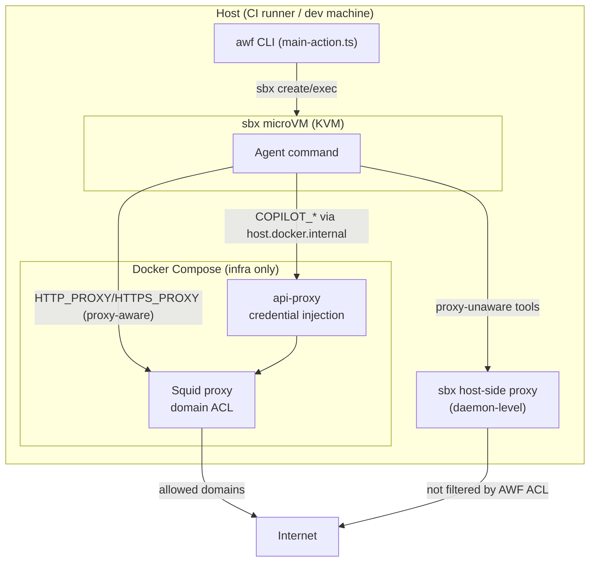

This document explains **Docker Sandboxes** (the `sbx` CLI) and how AWF uses it
to run an agent inside a hypervisor-isolated microVM while keeping AWF's own
egress-filtering infrastructure on the host. It is written for two audiences:

1. Engineers who want to understand *how the existing sbx integration works*.
2. Ourselves, if we later want to add **another microVM backend that runs on top
   of KVM** (e.g. Firecracker, Cloud Hypervisor, or a bespoke krun-based runner).

:::note
This is distinct from [Sandbox design](./sandbox-design.md), which explains why
AWF's *default* network sandbox uses Docker containers + Squid rather than a
microVM. This document covers the *optional* `--container-runtime sbx` path,
where the agent additionally runs inside a real microVM.
:::

## Part 1 — What is Docker Sandboxes (`sbx`)?

Docker Sandboxes is a Docker product (CLI: `sbx`, distributed via
[`docker/sbx-releases`](https://github.com/docker/sbx-releases)) that runs an AI
coding agent inside a **lightweight microVM**. Where a container shares the host
kernel, each sandbox boots its **own Linux kernel, filesystem, and Docker
Engine**, so the agent cannot see or touch the host except through explicitly
shared channels.

### Isolation model

Docker Sandboxes stacks five isolation layers:

- **Hypervisor isolation** — a separate kernel per sandbox. On Linux this rides
  on **KVM** (`/dev/kvm`; the installer adds the user to the `kvm` group). On
  macOS/Windows it uses the platform hypervisor. Agent processes inside the VM
  are invisible to the host.
- **Network isolation** — *all* HTTP/HTTPS egress is forced through a **host-side
  proxy** that enforces the sandbox's configured network policy (Open, Balanced,
  or Locked Down). Raw TCP, UDP, and ICMP are blocked at the network layer; DNS
  resolution goes through the proxy. AWF separately applies its deny-by-default Squid ACL.
- **Docker Engine isolation** — each sandbox runs its own Docker daemon inside
  the VM. `docker build` / `docker compose up` execute against the in-VM engine,
  with no path to the host daemon.
- **Workspace isolation** — the host workspace is shared via a **virtiofs
  filesystem passthrough**, mounted at the *same absolute path* as on the host.
  Default is a read-write direct mount (edits are live on the host); `--clone`
  gives a read-only mount plus a private in-VM clone.
- **Credential isolation** — the host-side proxy **injects auth headers** into
  outbound API requests. Raw credential values never enter the VM.

### The host-side proxy and `DOCKER_SANDBOXES_PROXY`

Every sandbox's outbound traffic exits through a proxy running on the host. That
proxy is where policy enforcement and credential injection happen. Two env vars
matter to AWF:

- **`DOCKER_SANDBOXES_PROXY`** — sets the *upstream* proxy for **sandbox traffic
  only**. Unlike `HTTP_PROXY`/`HTTPS_PROXY`, it does **not** affect image pulls
  or the daemon's own requests. It accepts `http://`, `https://`, `socks5://`,
  and `socks5h://` URLs. It must be set in the environment where the **sandbox
  daemon starts** — if the daemon is already running, it must be restarted for a
  change to take effect.
- **`DOCKER_SANDBOXES_NO_PROXY`** — excludes destinations from the above.

This upstream-proxy hook is the single most important integration point for AWF:
it lets AWF interpose its own Squid proxy *underneath* Docker's sandbox proxy.

### Lifecycle and CLI surface

| Command | Purpose |
| --- | --- |
| `sbx login` | Authenticate the local daemon (required before use). |
| `sbx create --name <n> <agent> <workspace> [mounts...]` | Create a VM with workspace + extra mounts. |
| `sbx exec [--workdir] [--env K=V] [--tty] <n> <cmd>` | Run a command inside the VM. |
| `sbx run <agent>` | Convenience: create + start an agent in one step. |
| `sbx stop <n>` / `sbx rm --force <n>` | Stop / delete the VM and its contents. |
| `sbx ls` | List sandboxes (also usable as an auth probe). |
| `sbx daemon status` | Inspect the background daemon. |

VMs persist until explicitly removed; stopping an agent does not delete the VM.

## Part 2 — How AWF uses `sbx`

AWF's default backend runs the agent as a **Docker Compose service** alongside
Squid and the api-proxy. The sbx backend instead runs the agent inside an sbx
microVM, while **Squid and the api-proxy stay in Docker Compose on the host**.
Only the agent crosses the hypervisor boundary; its egress is chained back down
through AWF's host-side Squid for domain filtering (and, optionally, through the
api-proxy for credential injection / model routing / token logging).

### The `executionModel` abstraction (`src/container-runtime.ts`)

AWF centralizes runtime differences in a small registry. Each runtime declares
an `executionModel` of either `compose` or `microvm`:

```ts
const RUNTIME_REGISTRY = {
  gvisor: { executionModel: 'compose', dockerRuntime: 'runsc', needsStaticDns: true },
  sbx:    { executionModel: 'microvm', dockerRuntime: undefined, needsStaticDns: false },
};
```

Three capability queries drive the rest of the codebase:

- `resolveDockerRuntime(name)` — maps a user-facing name to a Docker OCI runtime
  (`gvisor` → `runsc`); returns `undefined` for microVM backends (they don't use
  Docker's `runtime:` field).
- `runtimeNeedsStaticDns(name)` — whether AWF must inject static `/etc/hosts`
  entries (gVisor needs this; sbx manages its own DNS).
- `runtimeUsesComposeAgent(name)` — **the key switch**: `false` for `microvm`
  models. When false, the agent is *not* emitted into `docker-compose.yml`, and
  lifecycle is driven by the microVM CLI instead of `docker logs`/`docker wait`.
  Infrastructure services (Squid, api-proxy) are generated regardless.

### The lifecycle wrapper (`src/sbx-manager.ts`)

`sbx-manager.ts` is a thin, well-documented wrapper over the `sbx` CLI:

- **`createSandbox(config)`** — probes auth (`sbx ls`, falling back to
  `sbx daemon status` for diagnostics), then runs `sbx create --name <n> shell
  <workspace> [mounts...]`. It translates AWF's Docker-style
  `host:container:mode` mount strings into sbx's positional `path[:ro]` form,
  deduplicates paths, and always adds `/tmp`, `/usr/local/bin`, and `$HOME` so
  agent runtime files and installed CLIs (e.g. Copilot) are reachable.
- **`execInSandbox(name, cmd, opts)`** — runs `sbx exec` with optional
  `--workdir`, `--tty`, and `--env` flags, streams stdout/stderr, maps timeouts
  to exit code `124`, and returns the command's exit code.
- **`removeSandbox(name)`** — `sbx stop` then `sbx rm --force` (best-effort).
- **`isSbxAvailable()`** — `sbx version` presence check.

#### Secret sanitization

`sanitizeEnvForSbx()` strips secret-looking keys from the inherited `process.env`
used to launch the `sbx` CLI. Explicit entries passed through
`execInSandbox(..., { environment })` become `--env` arguments without this
filtering, so callers must sanitize that assembled guest environment separately.

:::caution
`sbx create` is deliberately **not** run with the sanitized env. The management
CLI needs some of those vars to look up credentials against the local daemon,
and those never enter the VM (the interior env is controlled separately by
`execInSandbox`). During `create`, AWF also temporarily unsets
`DOCKER_SANDBOXES_PROXY` (so registry/daemon auth isn't forced through a
not-yet-ready Squid) and `XDG_CONFIG_HOME` (so the sbx CLI finds credentials in
`$HOME/.config`, not wherever the Copilot harness pointed it).
:::

### Volume mounting & toolchain sharing

The most important structural difference from AWF's Docker/gVisor path is that
the microVM does **not** use a chroot. In compose mode the agent is bind-mounted
under `/host/...` and then `chroot`s into it; sbx instead uses **positional path
mounts where the host path maps to the identical path inside the VM**
(`/home/runner/work/...` on the host is `/home/runner/work/...` in the guest).
The generated command is:

```text
sbx create --name <name> shell <workspaceDir> [extraMount...] /tmp /usr/local/bin $HOME
```

(`shell` is sbx's generic agent image, which supplies the guest base OS.)

What `createSandbox()` shares, in order:

1. **Workspace** — `workspaceDir = $GITHUB_WORKSPACE || process.cwd()`, the first
   positional mount, read-write. This is the repo checkout the agent edits.
2. **Extra mounts** — `config.volumeMounts` (from `--volume`). AWF stores these
   Docker-style (`host:container:mode`), but sbx only accepts a positional
   `hostPath` with an optional `:ro` suffix, so the manager parses out the host
   path and mode and **discards the container-path segment** (host path = guest
   path). Default is read-write; `ro` mode becomes `hostPath:ro`.
3. **Three always-added system mounts** that carry the toolchain and runtime state:
   - **`/usr/local/bin`** — the toolchain seam. The Copilot CLI and other
     host-installed tools live here and are mounted straight in. Note it is
     *narrow*: only `/usr/local/bin`, **not** `/usr`, `/lib`, `/lib64`, or `/opt`.
   - **`/tmp`** — agent runtime files (rendered prompts, logs).
   - **`$HOME` tool dirs** — a **curated whitelist** of writable agent dirs, not
     the whole home directory. The manager mounts only the subdirs that exist on
     the host from `HOME_TOOL_SUBDIRS` (`.cache`, `.config`, `.local`,
     `.anthropic`, `.claude`, `.cargo`, `.rustup`, `.npm`, `.nvm`) plus the agent
     state dirs `.copilot` and `.gemini`. Credential-store dirs such as `.aws`,
     `.ssh`, `.docker`, `.kube`, `.azure` and `.gnupg` are **never** whitelisted,
     so they never enter the VM. Each whitelisted dir is mounted **wholesale** (as
     a directory — sbx positional mounts cannot target an individual file, so its
     loose files like `~/.copilot/mcp-config.json` are preserved).

**Scrubbing nested credential stores.** Several whitelisted dirs legitimately
hold tool settings but also stash a secret in a well-known child — e.g.
`.config/gh`, `.config/gcloud`, `.cargo/credentials`, `.claude/.credentials.json`,
`.copilot/config.json`, `.gemini/oauth_creds.json`. Because the parent is mounted
wholesale and sbx cannot overlay or mask a nested path, the manager instead
**moves those credential paths aside on the host before `sbx create` and restores
them after the sandbox is torn down** (`scrubHomeCredentials` /
`restoreHomeCredentials` in `sbx-manager.ts`). The move target is a
`.awf-sbx-cred-backup-<pid>` dir at the home root — never a mounted subdir — so
the secrets are absent from the VM while the benign tool state stays available.
This is the sbx analog of compose mode's `/dev/null` credential overlays, and the
per-parent list (`CREDENTIAL_PATHS_BY_PARENT` in
`services/agent-volumes/home-whitelist.ts`) is shared to prevent drift. The agent
receives whatever credentials it needs through the api-proxy or environment, not
by reading the host's on-disk auth store, so removing these paths is safe.

A `seenPaths` set deduplicates so no path is mounted twice, and
`execInSandbox(..., { workDir })` passes `--workdir` so commands run inside the
mounted workspace.

| Aspect | sbx (microVM) | Docker / gVisor (compose agent) |
| --- | --- | --- |
| Path model | Host path **==** guest path | Bind-mounted under `/host`, then `chroot /host` |
| System libraries | From the sbx `shell` **guest image** | Host `/usr`,`/bin`,`/lib`,`/lib64`,`/opt` mounted read-only |
| Toolchain binaries | Host `/usr/local/bin` mounted in | `/usr` from the host or sysroot; optional `chroot.binariesSourcePath` overlay at `/host/tmp/awf-runner-bin` (ro) |
| Workspace | `workspaceDir` positional (rw) | `<workspaceDir>:/host<workspaceDir>:rw` |
| Home | Curated `$HOME` tool-dir whitelist (rw), nested credential stores scrubbed before create | Empty home volume with only whitelisted subdirs |

:::caution Toolchain portability
Because host system libraries are **not** shared into the VM, a binary in
`/usr/local/bin` that dynamically links against host-specific libraries — or
expects an interpreter/runtime under `/usr` — can fail inside the microVM unless
the sbx guest image already provides a compatible base. This is the sharpest
contrast with compose mode's broad read-only `/usr`+`/lib` mounts, and the single
most important detail to plan for when building a **KVM-based microVM backend**:
you must either ship a guest image whose base matches the tools you mount in, or
widen the mount set to include the libraries those tools need.
:::

### Wiring into the main workflow (`src/commands/main-action.ts`)

`main-action.ts` decides `useSbx = !runtimeUsesComposeAgent(config.containerRuntime)`
and, when true, substitutes two functions into the shared workflow runner:

- **`sbxStartContainers`** wraps the normal `startContainers` (which brings up
  the infra-only compose: Squid + api-proxy, no agent service), then:
  1. Verifies `isSbxAvailable()`.
  2. Builds the agent environment (`buildAgentEnvironment`) using microVM-specific
     network targets (see below), merging credential env
     (`buildAgentCredentialEnv`) when the api-proxy is enabled.
  3. Calls `createSandbox({ workspaceDir, squidIp: SQUID_IP, extraMounts })`.
  4. Polls api-proxy health (via `host.docker.internal:10000/health`) since
     there is no compose `depends_on` gate across the VM boundary.
  5. Runs a Squid connectivity diagnostic (`curl --proxy ... https://api.github.com`).
- **`sbxRunAgentCommand`** runs the actual agent command with `execInSandbox`,
  honoring the agent timeout, workdir, TTY, and computed environment, and dumps
  api-proxy logs on non-zero exit for debugging.

Cleanup: when the runtime is microVM and `--keep-containers` is not set,
`removeSandbox(SBX_DEFAULT_NAME)` runs before compose teardown.

### Networking: crossing the VM boundary

Inside the microVM, AWF's internal Docker network (`172.30.0.0/24`) is **not
reachable** — the VM is on its own network. AWF compensates with two indirections:

- **Squid** is reached at the **sbx gateway IP** (`172.17.0.0` in code, i.e. the
  docker0 bridge range) on its published port `3128`, rather than the internal
  `172.30.0.10`. AWF sets `HTTP_PROXY`/`HTTPS_PROXY` inside the sandbox to
  `http://172.17.0.0:3128`, so proxy-aware agent tools route through AWF's Squid
  domain ACL. `DOCKER_SANDBOXES_PROXY` (the sbx daemon-level upstream knob) is
  **not** currently set by AWF — it must be present when the sbx daemon starts, a
  point AWF does not control — so the sbx daemon's own egress is not filtered by
  AWF's Squid.
- **The api-proxy** (credential injection) is reached via
  `host.docker.internal`, which resolves to the docker0 bridge from inside the
  VM. `COPILOT_*` / proxy env vars are pointed there instead of at
  `172.30.0.30`.

The net effect: agent tools that respect `HTTP_PROXY`/`HTTPS_PROXY` route through
AWF's Squid domain ACL; credentials are injected by AWF's api-proxy. Tools that
bypass proxy env vars are subject only to sbx's own host-side policy, not AWF's
ACL.

### Configuration surface

- CLI: `--container-runtime sbx`.
- gh-aw workflow frontmatter: `sandbox.agent.runtime: docker-sbx` (see the
  `smoke-docker-sbx*` workflows under `.github/workflows/`).
- Strict-security note (`src/commands/validators/security-mode.ts`): microVM
  runtimes enforce isolation at the hypervisor layer via
  `DOCKER_SANDBOXES_PROXY`, so AWF's Docker **network-isolation topology is not
  forced on** for them (`isMicroVmRuntime` skips that override). The api-proxy is
  still always enabled.

### End-to-end traffic flow



## Part 3 — Adding another KVM-based microVM backend

Because the microVM path is abstracted behind a small set of seams, adding a new
KVM backend (Firecracker, Cloud Hypervisor, krun/libkrun, QEMU/KVM, etc.) is
mostly a matter of implementing a manager and registering it. Here is the
checklist.

### 1. Register the runtime

Add an entry to `RUNTIME_REGISTRY` in `src/container-runtime.ts`:

```ts
myvm: {
  executionModel: 'microvm',
  dockerRuntime: undefined,     // not a Docker OCI runtime
  needsStaticDns: false,        // set true only if the VM can't reach an expected DNS
},
```

That entry makes `runtimeUsesComposeAgent('myvm')` return `false`, which omits
its agent from `docker-compose.yml` and skips the Docker network-isolation
override in strict mode. It does **not** select the new manager: the current
main workflow treats every microVM entry as sbx until runtime-specific dispatch is added.

### 2. Implement a manager (mirror `sbx-manager.ts`)

Provide `createSandbox` / `execInSandbox` / `removeSandbox` / `isAvailable`
equivalents for your VMM. Concretely, a KVM backend must:

- **Boot a microVM on `/dev/kvm`** with a kernel + rootfs. Confirm KVM is
  available (`/dev/kvm` present, user in the `kvm` group). On stock
  GitHub-hosted runners `/dev/kvm` is *not* exposed — this backend is only for
  self-hosted / nested-virt-capable environments.
- **Mount the workspace** at its host absolute path (virtiofs is the sbx choice;
  Firecracker typically uses a virtio-blk device or a virtiofsd sidecar). Also
  surface `/tmp`, `/usr/local/bin`, and `$HOME` like `createSandbox` does.
- **Inject the agent environment**, and **sanitize secrets** first — reuse the
  `sanitizeEnvForSbx()` pattern (strip `TOKEN|SECRET|KEY|...`).
- **Return the agent's exit code** faithfully (AWF propagates it), mapping
  timeouts to `124`.

### 3. Chain egress through AWF's Squid (the critical seam)

This is the property that keeps AWF's guarantees intact. Your VMM must force all
sandbox egress through AWF's host-side Squid:

- If the VMM offers an enforced upstream-proxy knob analogous to
  `DOCKER_SANDBOXES_PROXY`, point it at `http://<squidGatewayIp>:3128`.
- Otherwise, enforce egress outside the guest (for example at the VMM/TAP or
  host firewall) so the guest can reach only Squid. Guest `HTTP_PROXY` /
  `HTTPS_PROXY` settings may improve client compatibility, but are not an
  enforceable security boundary.
- Reproduce the boundary-crossing addressing that the sbx path uses: Squid at the
  **bridge gateway IP + published port** (not the internal `172.30.0.x`), and the
  api-proxy via a host-reachable name (`host.docker.internal`). See the
  `SBX_GATEWAY_IP` / `SBX_HOST_DOCKER_INTERNAL` handling in `main-action.ts`.

### 4. Wire it into `main-action.ts`

Introduce runtime-specific manager dispatch keyed by `config.containerRuntime`;
do not gate all microVM backends through the current sbx-specific branch. The
selected manager must provide start/run/cleanup wrappers that (a) start
infra-only compose, (b) build the agent environment with its network targets,
(c) create the VM, (d) check api-proxy and Squid across the boundary, and
(e) execute and tear down the agent with that backend's lifecycle commands.

### 5. Things to get right (lessons from the sbx path)

- **Daemon/proxy ordering** — don't force registry/daemon auth through Squid
  before Squid is healthy (sbx unsets `DOCKER_SANDBOXES_PROXY` during `create`).
- **Cross-boundary health checks** — compose `depends_on` does not extend into a
  VM. The current sbx path polls api-proxy and probes Squid, but logs/warns and
  proceeds on failure; a backend requiring a true health gate must abort startup.
- **Env leakage during management vs. interior** — management commands may need
  host env for auth; the *interior* env must be sanitized. Keep those two paths
  separate.
- **DNS** — decide whether the VM resolves DNS itself or via the proxy; set
  `needsStaticDns` accordingly.
- **Exit code + timeout fidelity** — CI relies on accurate propagation.

### Division of responsibility

| Concern | Docker Sandboxes (sbx) | AWF |
| --- | --- | --- |
| Hypervisor / kernel isolation | ✅ owns it | delegates to backend |
| In-VM Docker engine | ✅ owns it | — |
| Workspace mount | ✅ virtiofs passthrough | passes mount list |
| Domain egress ACL | its own default policy | ✅ **enforced by AWF Squid** (chained upstream) |
| Credential injection | its own proxy | ✅ **AWF api-proxy** (`COPILOT_*` retargeted) |
| Secret scrubbing of interior env | credential isolation | ✅ `sanitizeEnvForSbx()` |
| Lifecycle orchestration | CLI primitives | ✅ `sbx-manager` + `main-action` |

The takeaway for a new backend: **AWF keeps ownership of egress filtering and
credential injection**; the microVM backend only needs to provide isolation plus
a way to force egress through AWF's Squid.

## References

- Docker Sandboxes docs: <https://docs.docker.com/ai/sandboxes/>
  ([architecture](https://docs.docker.com/ai/sandboxes/architecture/),
  [security / isolation](https://docs.docker.com/ai/sandboxes/security/isolation/))
- `sbx` releases: <https://github.com/docker/sbx-releases>
- AWF source: `src/container-runtime.ts`, `src/sbx-manager.ts`,
  `src/commands/main-action.ts`, `src/commands/validators/security-mode.ts`
- Related: [Sandbox design](./sandbox-design.md), [Architecture](./architecture.md)
